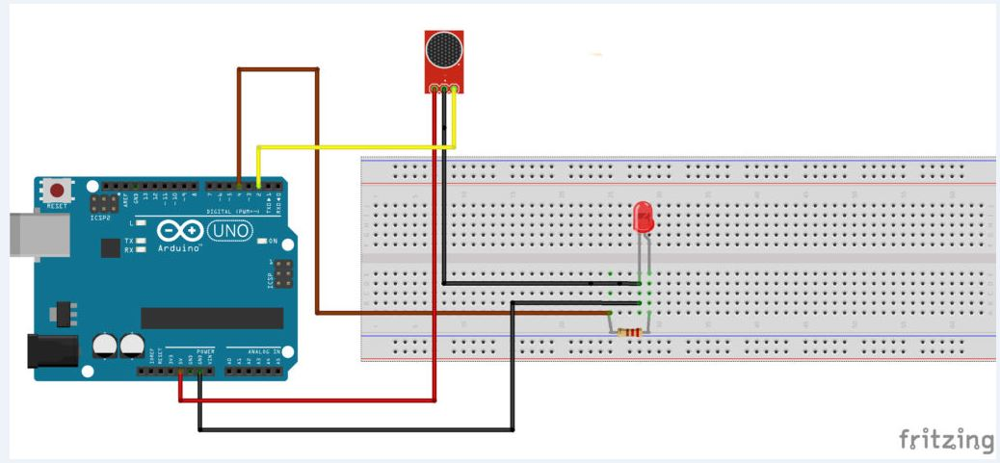

# F.R.I.E.N.D.S - Clapper
Simple **Arduino** sketch to turn the lights on and off by clapping like in the Friends sitcom opening theme.

**Sensor**  
When you turn on the microphone on and read its output, even without any sound, you will see that the reading will be 2.5V (if you feed with 5V). At every noise or sound the microphone "feels", the output signal will oscillate between this 2.5V voltage. Thus it is possible to see voltage peaks that represent higher audio intensities, which may be Clapping.   

To make things more interesting and unique, the output signal will be ON and OFF only if the software recognizes 4 claps in a row (like in the FRIENDS opening theme).  

Since the claps are recognized as peaks (higher or low ones), the best way to recognize a peak is by [Histeresys](https://en.wikipedia.org/wiki/Hysteresis "Histeresys"), utilizing a [Schmitt Trigger](https://howtomechatronics.com/how-it-works/electrical-engineering/schmitt-trigger/). This way we'll recognize any peak out of the histeresys boundaries.   

**Fritzing**  
  

**I'll Be There for You**  
*The Rembrandts*  

So no one told you life was gonna be this way  
Your job's a joke, you're broke  
Your love life's D.O.A  
It's like you're always stuck in second gear  
When it hasn't been your day, your week, your month  
Or even your year, but  
I'll be there for you  
(When the rain starts to pour)  
I'll be there for you  
(Like I've been there before)  
I'll be there for you  
('Cause you're there for me too)  
You're still in bed at ten  
And work began at eight  
You've burned your breakfast, so far   
Things are going great  
Your mother warned you there'd be days like these  
But she didn't tell you when the world has brought  
You down to your knees and  
I'll be there for you  
(When the rain starts to pour)  
I'll be there for you  
(Like I've been there before)  
I'll be there for you  
('Cause you're there for me too)  

